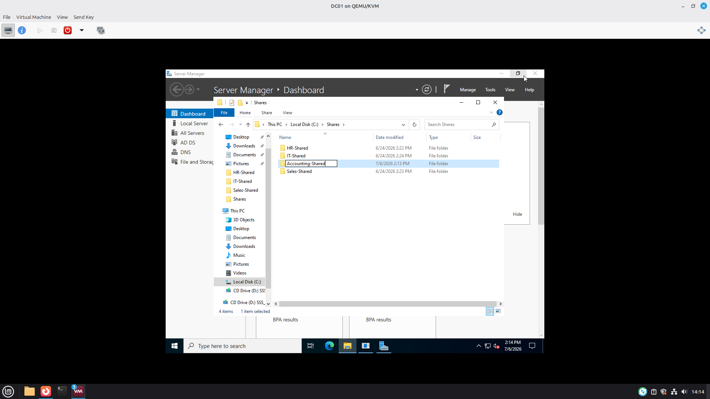
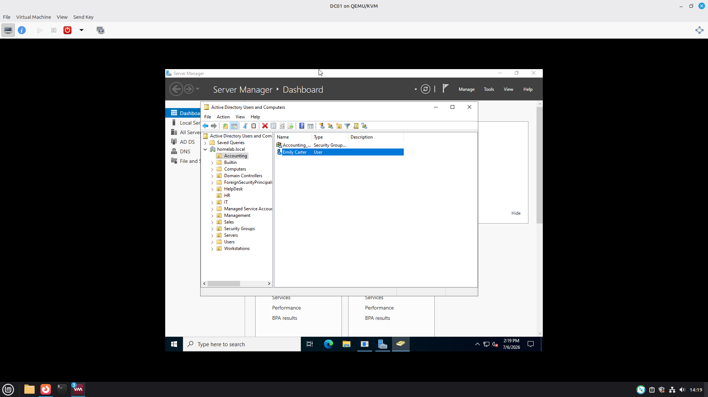
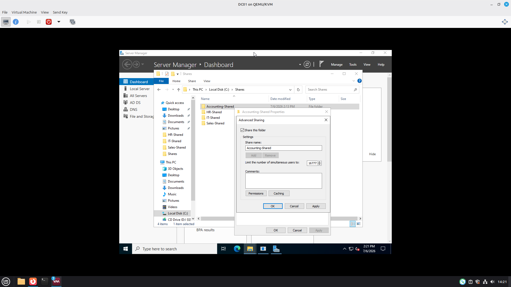
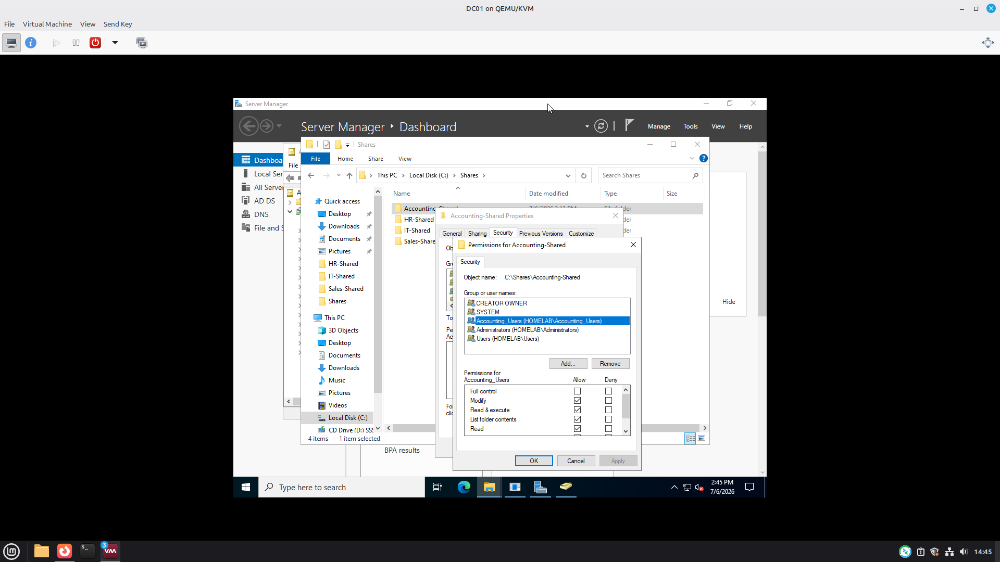
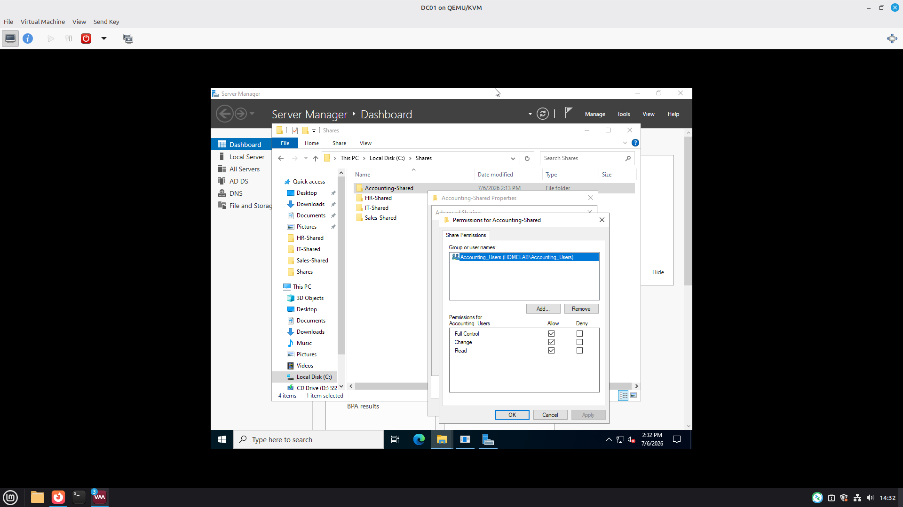
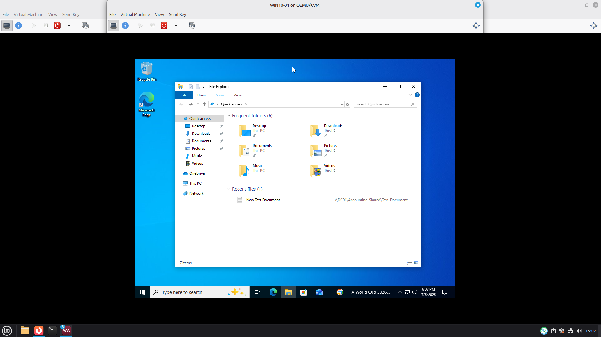

# Project 02 - Windows File Share and NTFS Permissions

## Overview

This project demonstrates how to configure Windows Server file shares using both Share Permissions and NTFS permission. Active Directory security groups were used to grant department-specific access, and access was verified from a Windows 10 Client. 

---

## Environment

- Windows Server 2022
- Windows 10 Client
- Active Directory Domain Services
- Active Directory Users ang Computers (ADUC)

 ---

 ## Objectives

 - Create departmental shared folders
 - Configured Advanced Sharing
 - Assigned Share Permissions
 - Configured NTFS permissions
 - Added users to Active Directory security groups
 - Tested access from Windows 10 client

---

## Skills Demonstrated

- Windows Server Administration
- Active Directory
- File Sharing NTFS Permissions
- Share Permissions
- Access Control
- Troubleshooting
- User and Group Management

---

# Screenshots

## Shared Folder Structure

## Share Persissions

## NTFS Permissions

## User Group Membership

## NTFS Permissions

## Accounting NTFS Permissions

## Conclusion

This project demonstrated how to securly configure Windows Server file shares using both Shared Permissions and NTFS Permissions in an Active Directory environment. Department security groups were used to control access, and permissions were validated from a Windows 10 client to ensure only authorized users could access shared resources. 
